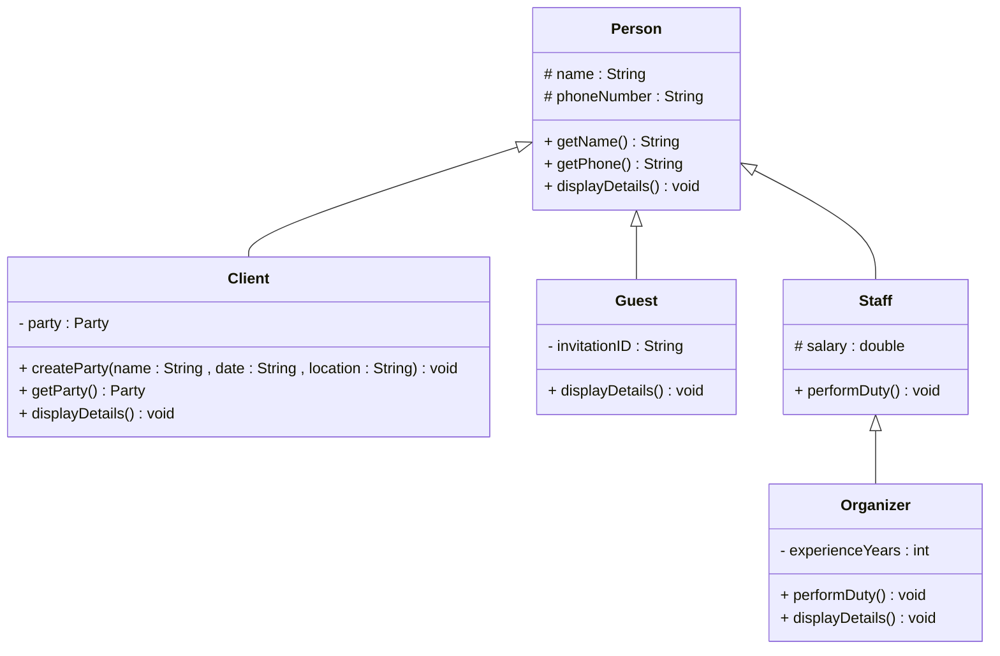

# CSC113-project-P1

```mermaid
classDiagram
class Person{
# name : String
# phoneNumber : String
+ getName() String
+ getPhone() String
+ displayDetails() void
}

class Client{
- party : Party
+ createParty(name : String , date : String , location : String) void
+ getParty() Party
+ displayDetails() void
}

class Guest{
- invitationID : String
+ displayDetails() void
}

class Staff{
# salary : double
+ performDuty() void
}

class Organizer{
- experienceYears : int
+ performDuty() void
+ displayDetails() void
}

Person <|-- Client
Person <|-- Guest
Person <|-- Staff
Staff <|-- Organizer

```
