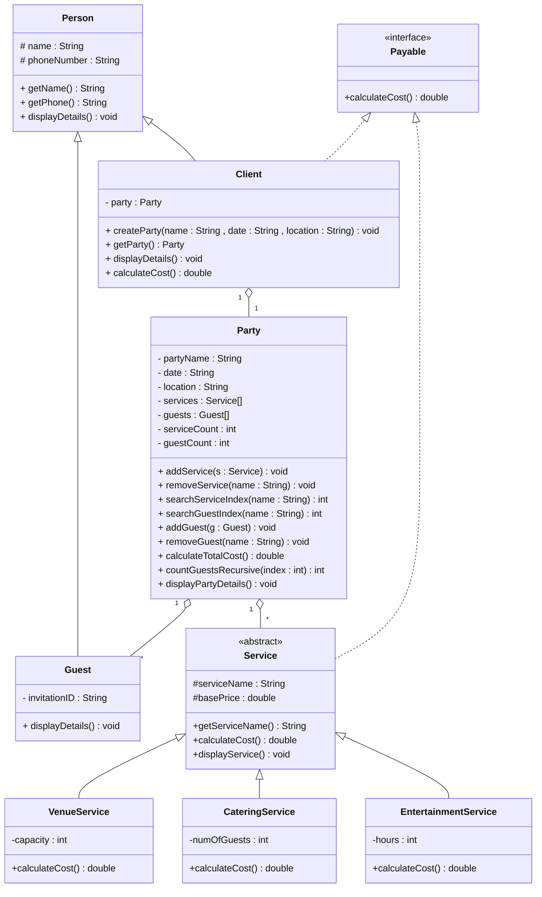

# CSC113-project-P1

```mermaid
classDiagram
class Party{
- partyName : String
- date : String
- location : String
- services : Service[]
- guests : Guest[]
- serviceCount : int
- guestCount : int
+ addService(s : Service) void
+ removeService(name : String) void
+ searchServiceIndex(name : String) int
+ searchGuestIndex(name : String) int
+ addGuest(g : Guest) void
+ removeGuest(name : String) void
+ calculateTotalCost() double
+ countGuestsRecursive(index : int) int
+ displayPartyDetails() void
}

class Person{
# name : String
# phoneNumber : String
+ getName() String
+ getPhone() String
+ displayDetails() void
}

class Client{
- party : Party
+ createParty(name : String , date : String , location : String) void
+ getParty() Party
+ displayDetails() void
+ calculateCost()  double
}

class Guest{
- invitationID : String
+ displayDetails() void
}


class Service {
<<abstract>>
#serviceName : String
#basePrice : double
+getServiceName()  String
+calculateCost()  double
+displayService()  void
}

class VenueService {
-capacity : int
+calculateCost()  double
}

class CateringService {
-numOfGuests : int
+calculateCost() double
}

class EntertainmentService {
-hours : int
+calculateCost()  double
}

class Payable {
<<interface>>
+calculateCost() double
}

Person <|-- Client
Person <|-- Guest


Client "1" o-- "1"Party
Party "1"o--"*" Guest
Party "1"o--"*" Service

Service <|-- VenueService
Service <|-- CateringService
Service <|-- EntertainmentService

Payable <|.. Client
Payable <|.. Service


```
