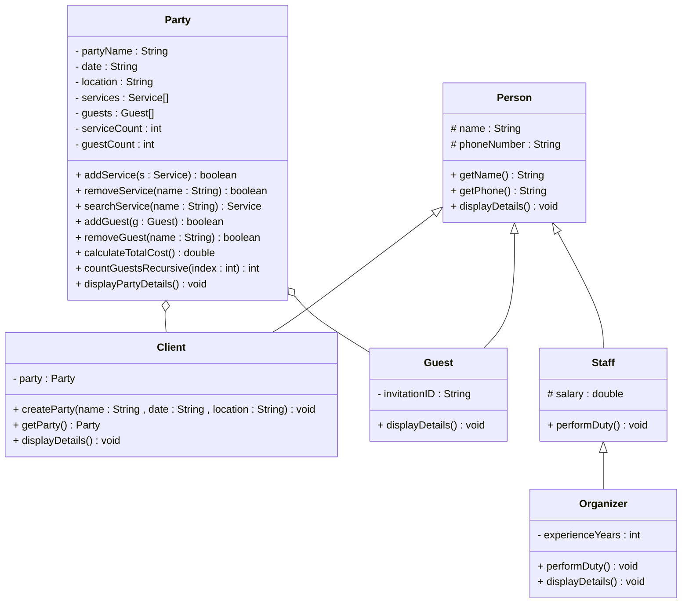

# CSC113-project-P1

```mermaid
classDiagram
class Person{
# name : String
# phoneNumber : String
+ getName() String
+ getPhone() String
+ displayDetails() void
}

class Client{
- party : Party
+ createParty(name : String , date : String , location : String) void
+ getParty() Party
+ displayDetails() void
}

class Guest{
- invitationID : String
+ displayDetails() void
}

class Staff{
# salary : double
+ performDuty() void
}

class Organizer{
- experienceYears : int
+ performDuty() void
+ displayDetails() void
}

class Party{
- partyName : String
- date : String
- location : String
- services : Service[]
- guests : Guest[]
- serviceCount : int
- guestCount : int
+ addService(s : Service) boolean
+ removeService(name : String) boolean
+ searchService(name : String) Service
+ addGuest(g : Guest) boolean
+ removeGuest(name : String) boolean
+ calculateTotalCost() double
+ countGuestsRecursive(index : int) int
+ displayPartyDetails() void
}

Person <|-- Client
Person <|-- Guest
Person <|-- Staff
Staff <|-- Organizer

Party o-- Client
Party o-- Guest

```
